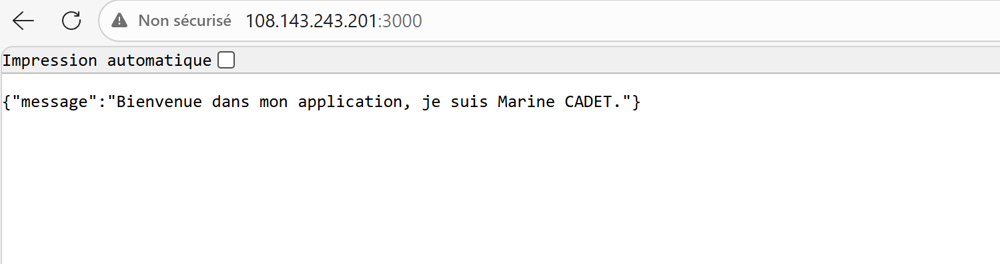

# Projet TP - Déploiement Continu CI/CD

Ce dépôt contient mon projet pour le TP d'intégration et de déploiement continus. Il s'agit d'une application web Node.js qui se déploie automatiquement sur une machine virtuelle Azure.

## Déclenchement du déploiement

Le processus est entièrement automatisé grâce à GitHub Actions. À chaque fois que je fais un `git push` sur la branche `main`, le workflow se déclenche tout seul. Il n'y a plus aucune manipulation manuelle à faire pour mettre le site en production.

## Fonctionnement du pipeline

Le fichier de configuration GitHub Actions est divisé en 4 étapes (jobs) :

1. **Tests unitaires :** Le pipeline installe les dépendances et lance mes tests avec Jest et Supertest. Il vérifie que mes pages (accueil, health et un endpoint sur les users) s'affichent correctement et renvoient bien un code HTTP 200.
2. **Tests E2E :** L'application est lancée en tâche de fond sur le serveur GitHub. Une fois qu'elle a fini de démarrer, Cypress prend le relais pour simuler un utilisateur qui navigue entre la page d'accueil et la page health en cliquant sur les boutons.
3. **Build et Push Docker :** Cette étape ne se lance que si les tests précédents sont validés. L'image Docker de l'application est construite puis envoyée sur mon compte Docker Hub avec le tag "latest".
4. **Déploiement sur la VM :** GitHub Actions se connecte en SSH à la machine virtuelle Azure. Le script télécharge la dernière image depuis Docker Hub, arrête l'ancien conteneur, le supprime, puis lance le nouveau sur le port 3000. 

## Choix techniques

- **Conteneurisation (Docker) :** J'ai utilisé Docker pour que l'application tourne exactement de la même manière en local, sur GitHub Actions et sur la VM.
- **Déploiement idempotent :** Mon script de déploiement utilise `|| true` lors de l'arrêt et de la suppression de l'ancien conteneur. Cela permet au script de ne pas planter si c'est le tout premier lancement ou si le conteneur n'existe pas. On peut donc relancer le workflow à l'infini sans créer d'erreurs.
- **Sécurité des variables :** Aucun mot de passe n'est écrit dans le code. L'IP de la machine Azure, le mot de passe SSH et le token Docker Hub sont tous stockés de manière sécurisée dans les GitHub Secrets.

## Instructions pour tester le projet en local

Voici les commandes pour le projet sur votre machine.

**1. Récupérer le projet et installer les dépendances**
```bash
git clone https://github.com/mrcdt/tp_deploiement.git
cd tp_deploiement
npm install
```

**2. Démarrer l'application normalement**
```bash
npm start
```
L'application sera accessible sur le navigateur à l'adresse `http://localhost:3000`.

**3. Lancer les tests**
- Pour les tests unitaires :
```bash
npm test
```
- Pour les tests E2E Cypress *(attention, il faut que l'application tourne déjà sur le port 3000 dans un autre terminal)* :
```bash
npx cypress run
```


